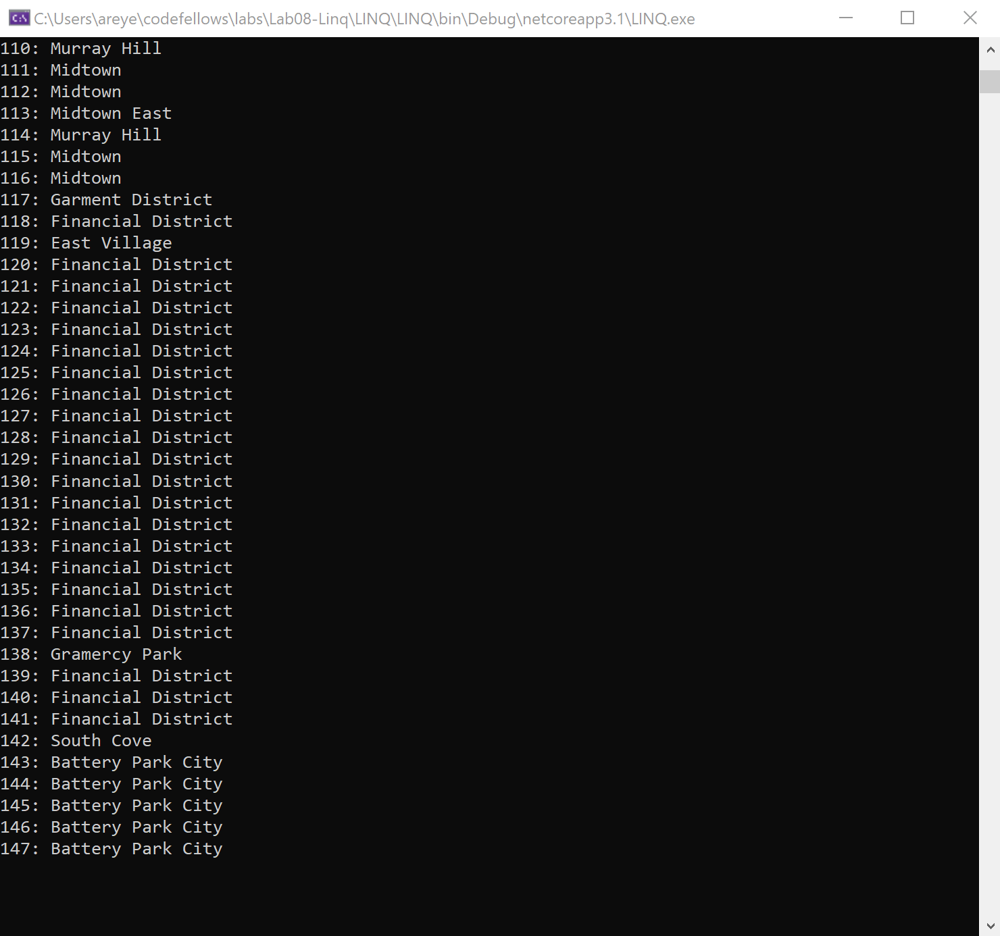
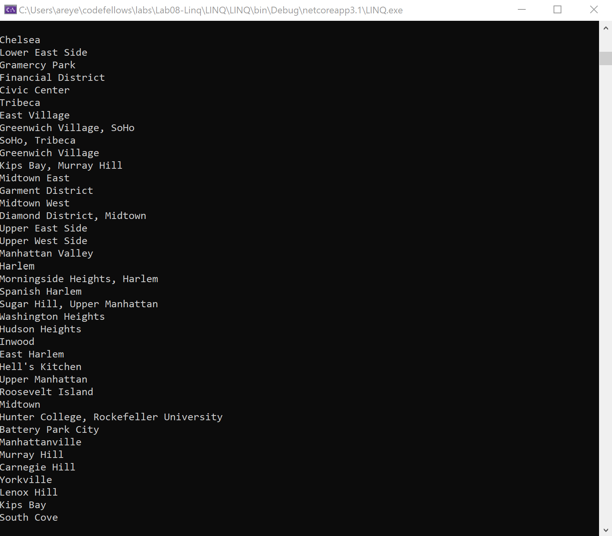

# LINQ


## About Me Quiz

Lab08-LINQ

*Author: Allyson Reyes*

----

## Description
This console app displays specific views that read into a JSON file.

---

### Getting Started
Clone this repository to your local machine.

```
$ git clone [https://github.com/areyes986/Lab08-Linq.git]
```

### To run the program from Visual Studio:
Select ```File``` -> ```Open``` -> ```Project/Solution```

Next navigate to the location you cloned the Repository.

Double click on the ```Lab08-Linq``` directory.

Then select and open ```LINQ.sln```

---

### Visuals

#### Application
  
Here we see that all neighborhoods are populated but not distinctly, there are still duplicates and still populates neighborhoods with no names  



Now it is populating all of the non duplicated neighborhoods that have names using a lambda method.


---

---
### Resources
[Class 09 Demo Code](https://github.com/codefellows/seattle-dotnet-401d10/blob/master/Class09/demo/LINQDemo/LINQDemo/Program.cs#L38)  
[Newton Soft LINQ to JSON](https://www.newtonsoft.com/json/help/html/LINQtoJSON.htm)  
[Newton Soft Serializing/Deserializing JSON](https://www.newtonsoft.com/json/help/html/SerializingJSON.htm)


### Change Log
1.7: *changed the statments into lambda* - 3.30.2020  
1.6: *populate re-did a query that combines the previous 3 all together* - 3.30.2020  
1.5: *populate neighborhoods names that are not duplicate* - 3.30.2020  
1.4: *populate neighborhoods with names* - 3.30.2020  
1.3: *populate ALL neighborhoods* - 3.30.2020  
1.2: *parsed the JSON file* - 3.30.2020    
1.1: *created the classes structure* - 3.30.2020  


------------------------------
